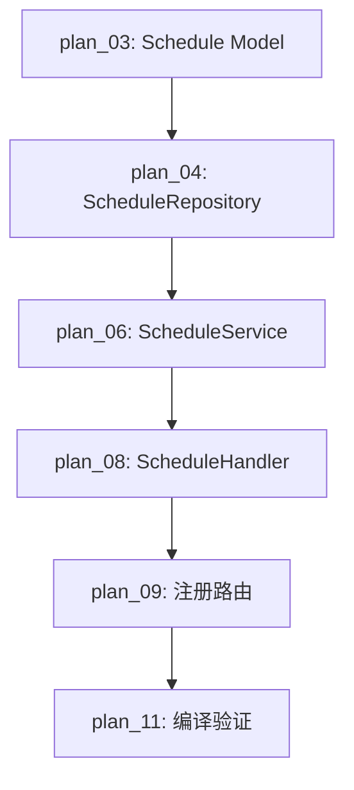

# 综合执行方案 — 0001 团期管理

> 基于 auto-dev-loop Step2 规范生成

## 1. 📝 方案概述与架构假设

- **方案目标:** 将团期管理锁定规格书转化为可执行的工程计划
- **核心架构决策:** 遵循 yule-go 四层架构（Handler → Service → Repository → Model）
- **技术栈选型:** Go + Gin + GORM + MySQL 8.0
- **关键假设:** schedules 表 DDL 已存在，routes 表有初始数据

## 2. 🌐 任务依赖关系图

### 2.1 任务分解树

```
plan_01 (里程碑): 团期管理后端 API
├── plan_02 (模块): 数据层
│   ├── plan_03 (任务): 定义 Schedule Model
│   └── plan_04 (任务): 实现 ScheduleRepository
├── plan_05 (模块): 业务层
│   └── plan_06 (任务): 实现 ScheduleService
├── plan_07 (模块): 接口层
│   ├── plan_08 (任务): 实现 ScheduleHandler
│   └── plan_09 (任务): 注册路由
└── plan_10 (模块): 验证
    └── plan_11 (任务): 编译验证 + API 测试
```

### 2.2 任务依赖图



## 3. 🧪 测试计划

| 验收标准 | 测试用例 ID | 测试类型 | 测试步骤 | 预期结果 |
|:---|:---|:---|:---|:---|
| AC-01: 创建团期 | TC-001 | API 测试 | POST /api/v1/admin/schedules | 200 + 团期详情 |
| AC-02: 编辑团期 | TC-002 | API 测试 | PUT /api/v1/admin/schedules/:id | 200 + 更新后数据 |
| AC-03: 取消团期 | TC-003 | API 测试 | PUT /api/v1/admin/schedules/:id/cancel | 200 |
| AC-04: 按周查询 | TC-004 | API 测试 | GET /api/v1/schedules?week=xxx | 200 + 团期列表 |
| AC-05: 名额满标记 | TC-005 | 单元测试 | 创建名额1的团期，模拟下单 | 状态变为 full |
| AC-06: 重复去重 | TC-006 | API 测试 | 重复创建同线路同日期 | 400 错误 |

## 4. ⏪ 回滚预案

- **触发条件:** `go build` 编译失败或核心 API 测试不通过
- **回滚步骤:** `git checkout` 回到上一个可用 commit
- **验证:** 重新 `go build` 确认编译通过

## 5. 📡 监控指标

| 指标 | 来源 | 阈值 |
|:---|:---|:---|
| API 响应时间 | Gin 日志 | < 500ms |
| 编译成功率 | go build | 100% |
